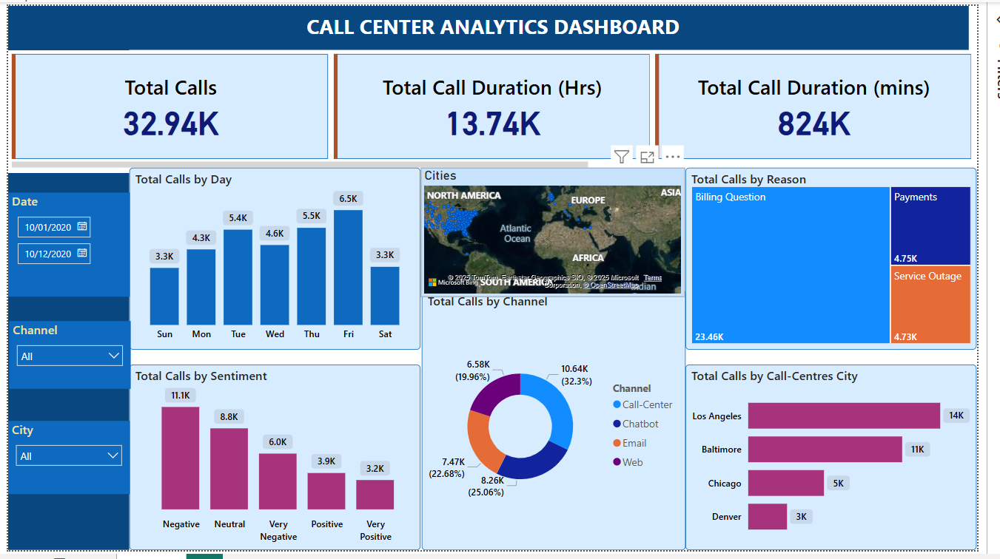

# Data Analytics Portfolio
Welcome to my Portfolio! This portfolio showcases a collection of projects that demonstrate my skills in data analysis, SQL, Power BI and various other analytical and technical fields. The projects span different industries and topics and they reflect my passion for transforming raw data into actionable insights

## [Click here to view my Projects in Github](https://github.com/Vasu-Vinaik123/Vasu-s_Portolio.git)

# Project 1: Call Center Analytics Dashboard
This Power BI dashboard provides key insights into call center performance by tracking essential metrics such as total calls, call durations, and response times. The dashboard enables data-driven decision-making for improving efficiency and customer satisfaction.

* Data was taken from Call Center Dataset
* Identified KPIs
* Walkthrough the data and connected PowerBI to the database
* Did the Data cleaning by handling the null values and ensuring the correct data types
* Use Dax for custom calculations and metrics
* Build visualizations and applied themes, colors and filters for better visualization
* Published the dashboard
## Dashboard

# Project 2: Classic Cars Sales Analytics
This project leverages the Classic Car Models Sales dataset, which contains sales records, customers, products, orders, employees, and offices. The analysis aims to provide key insights into classic cars sales business, such as **sales performance, customer details, orderdetails and order quantity**. By using **SQL queries**, this project explores and extracts valuable insights to aid in better business decision-making 

## Key Areas of Analysis:
* Sales Performance
* Customer Information
* Order Details & Quantities
* Order Status
* Product Information
* Geographic and Employee Data

## SQL Code  [Classic_model_analytics.sql](https://github.com/Vasu-Vinaik123/Vasu-s_Portolio/blob/main/Classic_Models_Analytics/Classic_model_analytics.sql)
 
