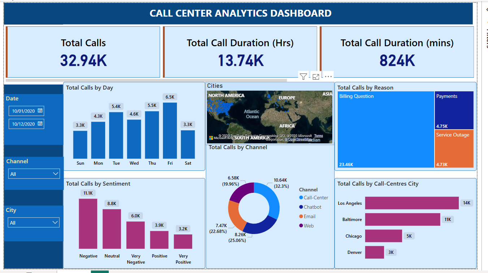

Welcome to my Portfolio! This portfolio showcases a collection of projects that demonstrate my skills in data analysis, SQL, Power BI and various other analytical and technical fields. The projects span different industries and topics and they reflect my passion for transforming raw data into actionable insights

### [Click here to view my Projects in Github](https://github.com/Vasu-Vinaik123/Data-Analysis-Portfolio.git)
 
## Project 1: Call Center Analytics Dashboard
This Power BI dashboard provides key insights into call center performance by tracking essential metrics such as total calls, call durations, and response times. The dashboard enables data-driven decision-making for improving efficiency and customer satisfaction

* Data downloaded from Call Center Dataset
* Walked through the data and connected PowerBI to the database
* Identified KPIs
* Did the Data cleaning by handling the null values and ensuring the correct data types
* Use Dax for custom calculations and metrics
* Build visualizations and applied themes, colors and filters for better visualization
* Published the dashboard

### Dashboard

  

## Project 2: Classic Cars Sales Analytics
This project leverages the Classic Car Models Sales dataset, which contains sales records, customers, products, orders, employees, and offices. The analysis aims to provide key insights into classic cars sales business, such as **sales performance, customer details, orderdetails and order quantity**. By using SQL queries, this project explores and extracts valuable insights to aid in better business decision-making

### Key Areas of Analysis:
* Sales Performance
* Customer Information
* Order Details & Quantities
* Order Status
* Product Information
* Geographic and Employee Data

**SQL Code** [Classic_model_analytics.sql](https://github.com/Vasu-Vinaik123/Data-Analysis-Portfolio/blob/main/Classic_Models_Analytics/Classic_model_analytics.sql)

  

## Project 3: Coffee Shop Sales Analytics
This project analyzes a coffee sales dataset, providing key business insights through SQL queries. The analysis focuses on total sales, monthly trends, and performance comparisons to help businesses make data-driven decisions.

### Key Performance Indicators (KPIs)
* Total Sales in Month of May
* Sales Per Month
* Month Over Month Sales Difference
* Month Over Month Sales Growth
* Comparing Daily Sales with the average sales in the May
* Top 10 products that generated highest revenue in the month of May

**SQL Code** [Coffee_shop_sales_analytics.sql](https://github.com/Vasu-Vinaik123/Data-Analysis-Portfolio/blob/main/Coffee_Sales_Analytics/Coffee_Shop_Sales_Analytics.sql)

  

## Connect with Me
* Email: [vasuvinaik123@gmail.com](mailto:vasuvinaik123@gmail.com)
* LinkedIn: [vasuvinaik](https://www.linkedin.com/in/vasu-vinaik/)

  
